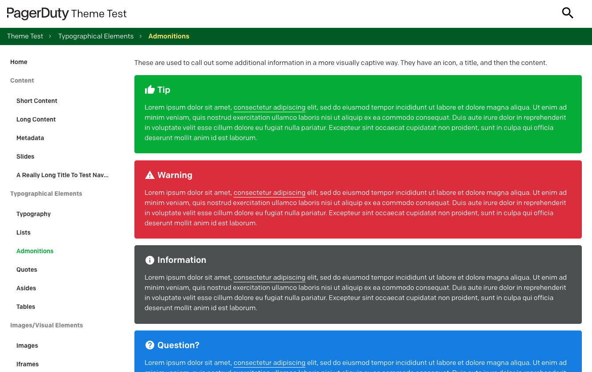

# PagerDuty MkDocs Theme [](https://circleci.com/gh/PagerDuty/mkdocs-theme-pagerduty)

This is our custom MkDocs theme used for our [Ops Guides](https://www.pagerduty.com/ops-guides/) family of websites. It gives us a consistent design across all the sites, and allows us to make changes in a single place rather than individually in each documentation repository.



Our original theme was a heavy customization of [Material for MkDocs](https://github.com/squidfunk/mkdocs-material) version [0.2.4](https://github.com/squidfunk/mkdocs-material/releases/tag/0.2.4) by [squidfunk](https://github.com/squidfunk). This new theme keeps a similar visual style, but was built from the ground-up specifically for our use cases.

You probably do not want to use this theme for your own sites, as a lot of things are hardcoded to point to PagerDuty things. We recommending looking at the latest version of the excellent [MkDocs Material](https://squidfunk.github.io/mkdocs-material/) theme for your documentation instead.

## Development
We use [MkDocs](http://www.mkdocs.org/) to create our static sites. This repository contains a set of test documentation pages with "Lorem ipsum" text in a variety of situations, intermixed with images, callouts and so on. The test documentation will use the current raw theme files so we can get an idea of how everything looks.

### Native
For local development on your native device,

1. Install [MkDocs](http://www.mkdocs.org/#installation). `pip install mkdocs`
1. Install [MkDocs PyMdown Extensions](https://squidfunk.github.io/mkdocs-material/extensions/pymdown/). `pip install pymdown-extensions`
1. Install [Pygments](https://pygments.org/) if you want syntax highlighting for any code examples. `pip install pygments`
1. To test locally, run `mkdocs serve` from the project directory.
1. You can now view the website in your browser at `http://127.0.0.1:8000`. The site will automatically update as you edit the code.

### Docker
For local development using Docker,

1. Build the docker image and load it for immediate use. `docker build --load -t mkdocs .`
1. Run the container and pass through your current working directory. `docker run -v $(pwd):/docs -p 127.0.0.1:8000:8000 mkdocs`
1. You can now view the website in your browser at `http://127.0.0.1:8000`. The site will automatically update as you edit the code.

_Note: If you're using an Apple Silicon device, add `--platform linux/arm64/v8` to the `docker build` command to get a native Apple Silicon image. That will work faster than translating an arm64 image._

## Installing
To install and use the theme for other projects, clone this repository and then run `python3 setup.py install`.

Then in your project `mkdocs.yml` file specify your theme as `pagerduty`. You should also specify a title for the site while you're there.

```
theme:
  name: 'pagerduty'
  title: 'Your Site Title'
```

## Deploying
There are no special deployment instructions. Any PagerDuty sites using this theme will automatically get the latest version on their next deployment. If you want to update immediately, you can force a redeployment of the various documentation sites in CI.

## License
[Apache 2](http://www.apache.org/licenses/LICENSE-2.0) (See [LICENSE](LICENSE) file)

## Contributing
Thank you for considering contributing! If you have any questions, just ask - or submit your issue or pull request anyway. The worst that can happen is we'll politely ask you to change something. We appreciate all friendly contributions.

Here is our preferred process for submitting a pull request,

1. Fork it ( https://github.com/PagerDuty/mkdocs-theme-pagerduty/fork )
1. Create your feature branch (`git checkout -b my-new-feature`)
1. Commit your changes (`git commit -am 'Add some feature'`)
1. Push to the branch (`git push origin my-new-feature`)
1. Create a new Pull Request.
